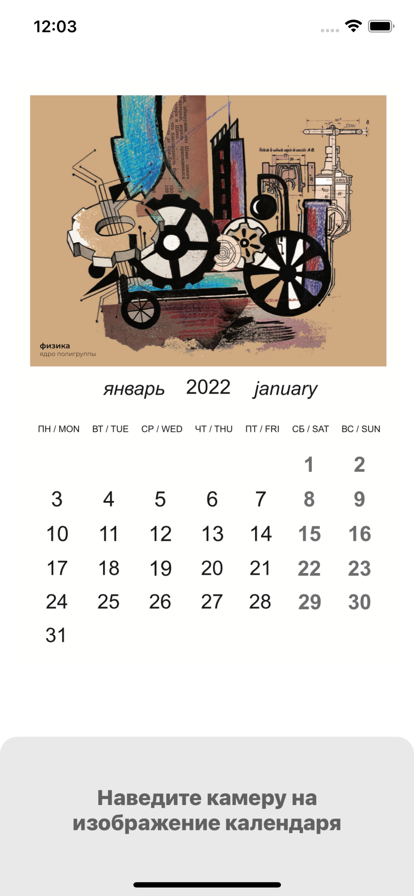
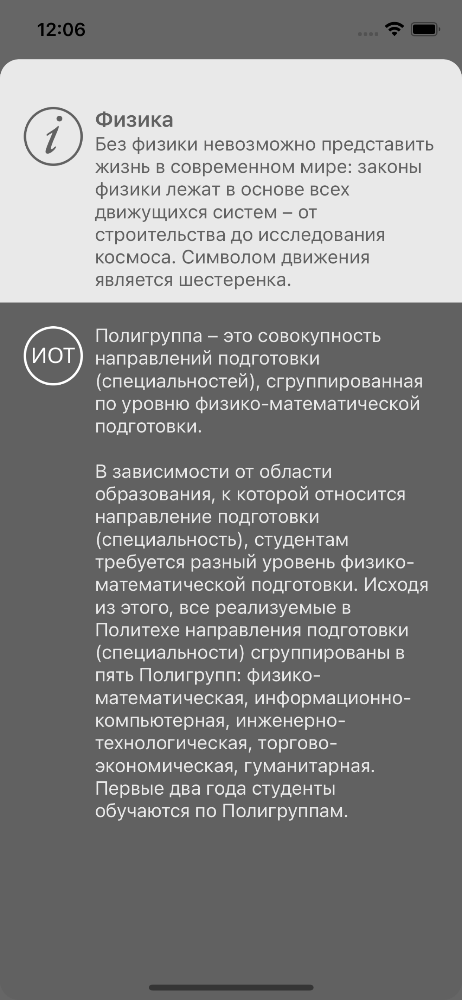

# Календарь ИОТ 2022

## Описание
Приложение является компаньоном для физической версии календаря СПбПУ им. Петра Великого “Индивидуальные образовательные траектории” — 2022, которое, при наведении камерой устройства на календарь, проигрывает анимацию в дополненной реальности и выдает пользователю информацию об иллюстрации и связанным с ней учебным направлением.

## Скриншоты

### Главный экран

### Информация о траектории

## Технологии и инструменты

### Стек технологий
- Swift
- UIKit
- ARKit

Проект разработан по заказу Центра качества образования, при поддержке Управления по связям с общественностью Санкт-Петербургского Политехнического университета им. Петра Великого
